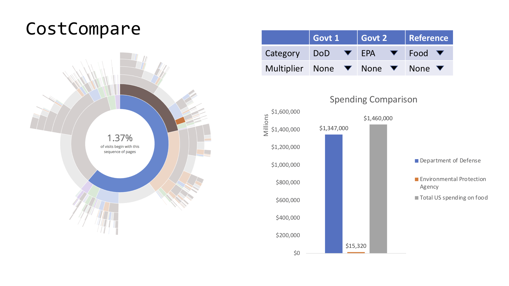
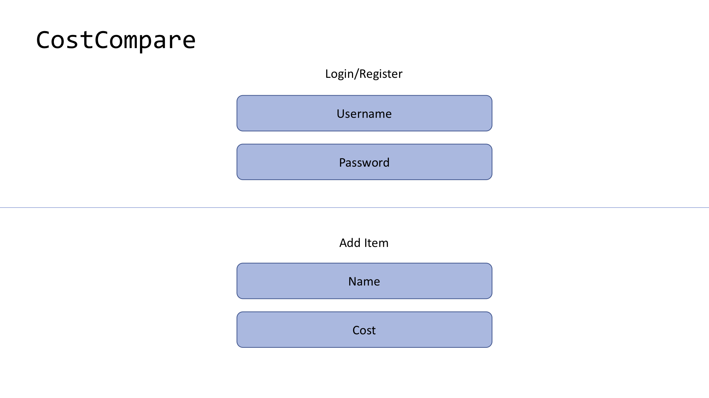

# Capstone
## CostCompare

### Scope
CostCompare is an app that allows the user to frame the cost of various federal spending programs to reference points (both pre-populated and user-added) that would be familiar to the average consumer. For example:
* How does the US defense budget compare to total spending on food in the US?
* What is the distribution of spending amongst various top-level federal agencies and their subsidiaries?
* How much money per taxpayer is spent on the Export-Import Bank?

The app would serve to help users become more familiar with the magnitude of the numbers behind important government spending questions in order to better inform their opinions on these issues.

### User Stories
User will be able to:
* Use [sunburst visualization](https://bl.ocks.org/kerryrodden/766f8f6d31f645c39f488a0befa1e3c8) to inspect pre-populated data on relative costs of different government programs
* Use search bars/drop-downs [tbd, depending on data exploration] to to create custom graphs comparing different government programs and consumer references
 * Government programs: Granularity TBD, but at minimum will show top-level agencies and ideally one or more levels of subsidiaries
 * Consumer references: Will contain a variety of common consumer products, ranging from a Big Mac to the median house. User will also be able to add/edit/delete their own items after logging in

### Wireframes

### Data Models
* Top-level agency:
 * name (str)
 * agency_id (num)
 * budget_authority_amount (num)
 * budget_total (num)
 * budget_pct (num)
* Subsidiary:
 * name (str)
 * id (num)
 * amount (num)
 * type (str)
 * parent (top-level agency)
* Consumer reference:
 * name (str)
 * price (num)
 * user (user)
* User:
 * username (str)
 * password (str)

### External Resources
* [USA Spending API](https://api.usaspending.gov/)
* [Sunburst visualization](https://bl.ocks.org/kerryrodden/766f8f6d31f645c39f488a0befa1e3c8)
* Various other consumer cost data

### Milestones
* Seed data/create relations (11/29)
* Routes and user interaction to support basic display (12/2)
* Fully fleshed-out display (12/5)